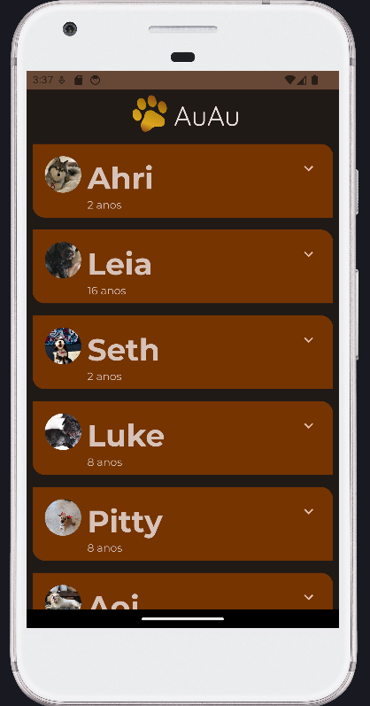

# Desenvolvimento Android Nativo - Kotlin
## Integração entre o JetPack Compose & Material Design
### Tópicos desta etapa:

#### Parte I
- Material Design & JetPack Compose
- Material Theme Builder
- Importando e Usando Temas
- Mapeando cores no App
- Trabalhando com formas nos composable
- Adicionando tipografia
- Adicionando um TopAppBar

#### Parte II
- Finalizando o App com animações e eventos
- Ícones
- Gerenciando estados
- mutableStateOf()
- remember()

### Referência Visual

Este projeto é inspirado na galeria de modelos do Google/Android

Google Developers
 
https://github.com/google-developer-training/basic-android-kotlin-compose-training-woof

